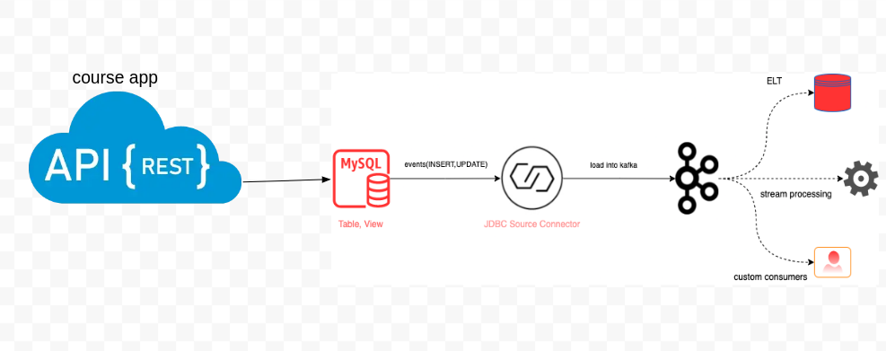
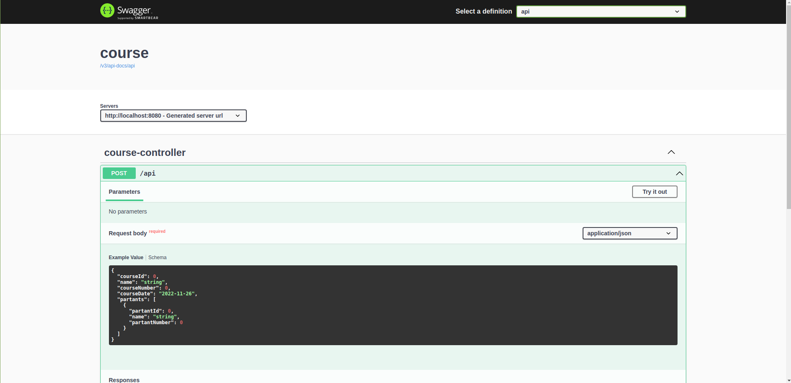
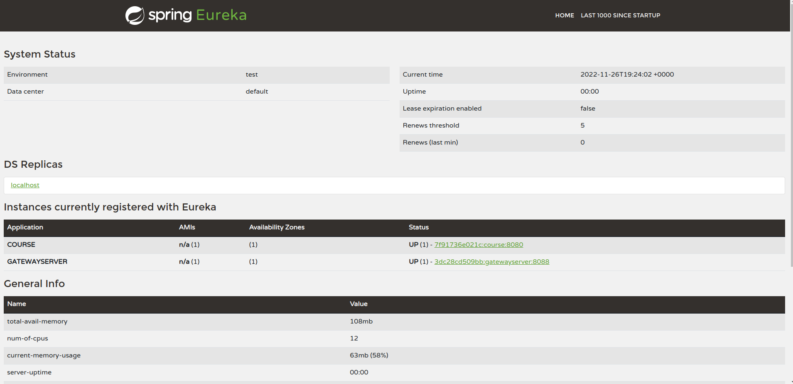

# Java 17 , springboot and kafka-connect-jdbc-streams

Goal use  [`Kafka`](https://kafka.apache.org),
[`Kafka Connect`](https://docs.confluent.io/current/connect/index.html) 
and [`Kafka Streams`](https://docs.confluent.io/current/streams/index.html). 
For this, we have: `course api` that inserts/updates records in [`MySQL`](https://www.mysql.com);
`Source Connectors` that monitor inserted/updated records in `MySQL` and push messages related to those changes to `Kafka`;

We can finally, use `tiers applications` that listens messages from `Kafka`, treats them using `Kafka Streams` and push new messages back to `Kafka`.

## Project Diagram



## Applications : Microservice architecture

- ### course

  microservices  [`Spring Boot`](https://docs.spring.io/spring-boot/docs/current/reference/htmlsingle/) application that exposes a REST API to manage `Course`and  `Partant`. The data is stored in `MySQL`.
  
  
- ### config
We use spring cloud config server to crypt and store sensitive param.
- ### eurekaserver and  gatewayserver 
  
Spring cloud netflix Eureka server and Gateway  server are implemented for future when we start to have more  microservices applications
It can help to handle complex architecture.
## Prerequisites

- [`Java 17+`](https://www.oracle.com/java/technologies/downloads/#java17)
- [`Docker`](https://www.docker.com/)
- [`Docker-Compose`](https://docs.docker.com/compose/install/)

## (De)Serialization formats

In order to run this project, you can use [`JSON`](https://www.json.org) 
NB : You can use  [`Avro`](https://avro.apache.org/docs/current/gettingstartedjava.html) format to serialize/deserialize data to/from the `binary` format used by Kafka. 
The default format is `JSON`. Throughout this document.
## Start Environment
- Open a terminal and inside configser , course , eurekaserver and gatewayserver run
  ```
  mvn spring-boot:build-image -Dmaven.test.skip=true
  ```
  Will generate latest docker images of configser , course , eurekaserver and gatewayserver 
- To check images inside docker run 
  ```
  docker images
  ```
- Open a terminal and inside `pmu` root folder run
  ```
  docker-compose up -d
  ```
- Check that containers are running
  ```
  docker-compose ps
  ```
   ```
  > **Note**: Sometime you need to restart eurekaserver.
  > ```
- Open a terminal and inside `pmu/kafka`  folder run
  ```
  docker-compose up -d
  ```
  > **Note**: During the first run, an image for `kafka-connect` will be built. Run the command below to rebuild it.
  > ```
  > docker-compose build
  > ```

- Wait for all Docker containers to be up and running. To check it, run
  ```
  docker-compose ps
  ```
  
## Create Kafka Topics

In order to have topics in `Kafka` with more than `1` partition, we have to create them manually and not let the connectors to create them for us. So, for it:

- Open a new terminal and make sure you are in `pmu/kafka` root folder

- Run the script below
  ```
  ./create-kafka-topics.sh
  ```

  It will create the topics `mysql.pmu_course.course` with `5` partitions.

## Create connectors

Connectors use `Converters` for data serialization and deserialization. If you are configuring `For JSON (de)serialization`, the converter used is `JsonConverter`. On the other hand, the converter used is `AvroConverter`.


Steps to create the connectors:

- In a terminal, navigate to `pmu/kafka` root folder

- Run the following script to create the connectors on `kafka-connect`

  - **For JSON (de)serialization**

    ```
    ./create-connectors-jsonconverter.sh
    ```

- You can check the state of the connectors and their tasks on `Kafka Connect UI` or running the following script
  ```
  ./check-connectors-state.sh
  ```

- Once the connectors and their tasks are ready (`RUNNING` state), you should see something like
  ```
{"name":"mysql-source-course","connector":{"state":"RUNNING","worker_id":"kafka-connect:8083"},"tasks":[{"id":0,"state":"RUNNING","worker_id":"kafka-connect:8083"}],"type":"source"}
  ```

- On `Kafka Connect UI` (http://localhost:8086), you should see

  

- If there is any problem, you can check `kafka-connect` container logs
  ```
  docker logs kafka-connect
  ```


## Useful Links/Commands

- **Kafka Topics UI**

  `Kafka Topics UI` can be accessed at http://localhost:8085

- **Kafka Connect UI**

  `Kafka Connect UI` can be accessed at http://localhost:8086

- **Schema Registry UI**

  `Schema Registry UI` can be accessed at http://localhost:8001

- **Schema Registry**

  You can use `curl` to check the subjects in `Schema Registry`

  - Get the list of subjects
    ```
    curl localhost:8081/subjects
    ```
  - Get the latest version of the subject `mysql.pmu_course.course-value`
    ```
    curl localhost:8081/subjects/mysql.pmu_course.course-value/versions/latest
    ```

- **Kafka Manager**

  `Kafka Manager` can be accessed at http://localhost:9000

  _Configuration_
  - First, you must create a new cluster. Click on `Cluster` (dropdown on the header) and then on `Add Cluster`
  - Type the name of your cluster in `Cluster Name` field, for example: `MyCluster`
  - Type `zookeeper:2181` in `Cluster Zookeeper Hosts` field
  - Enable checkbox `Poll consumer information (Not recommended for large # of consumers if ZK is used for offsets tracking on older Kafka versions)`
  - Click on `Save` button at the bottom of the page.

## References

- https://cloud.spring.io/spring-cloud-static/spring-cloud-stream-binder-kafka/current/reference/html/spring-cloud-stream-binder-kafka.html#_kafka_streams_binder
- https://github.com/spring-cloud/spring-cloud-stream-samples/tree/master/schema-registry-samples
- https://www.confluent.io/blog/simplest-useful-kafka-connect-data-pipeline-world-thereabouts-part-1 (2 and 3)
- https://www.confluent.io/blog/kafka-connect-deep-dive-converters-serialization-explained
